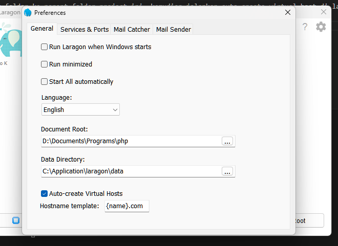

<h1 align="center">🧾 PROJECT-POINT-OF-SALES</h1>
<p align="center"><em>Empower Sales, Elevate Experiences, Drive Success.</em></p>

<p align="center">
  
  
  
  
</p>

<p align="center"><em>Built with language:</em></p>

<p align="center">
  
  
  
</p>

<p align="center"><em>Tools and technologies:</em></p>

<p align="center">
  
  
  
  
  
    
  
  
</p>

<p align="center"><em>Architecture :</em></p>

<p align="center">
  
  
</p>

---

# **Deskripsi Proyek**
Proyek ini adalah sistem Point of Sales (POS) berbasis PHP Native dengan implementasi PSR-4 autoload dan menggunakan database MySQL untuk penyimpanan data. Proyek ini dirancang untuk fleksibilitas, skalabilitas, dan kemudahan pengelolaan.

---

# **Langkah-Langkah Setup**

## **1. Clone Proyek**
Clone repository ini ke direktori lokal kamu:
```bash
git clone https://github.com/abyalax/Project-Point-Of-Sales.git
```

ubah nama directory menjadi 
```
📂 point-of-sales
```

## **2. Konfigurasi Environment**
Salin file `.env.example` (jika tersedia) menjadi `.env` dan sesuaikan konfigurasi database:
```dotenv
DB_HOST=127.0.0.1
DB_PORT=3306
DB_DATABASE=db_pos
DB_USERNAME=root
DB_PASSWORD=

# Virtual Host
BASE_URL = /
# nama folder : point-of-sales
URL_TEST = http://point-of-sales.com
```

## **3. Install Dependencies**
Jalankan perintah berikut untuk menginstall dependencies php:
```bash
composer install
```
Jalankan perintah berikut untuk menginstall dependencies node js:
```bash
npm install
```

## **4. Import Struktur Database**
Gunakan file migrasi terbaru (`init-3.sql`) untuk menginisialisasi struktur database. Jalankan perintah ini di MySQL:
```bash
mysql -u username -p database_name < database/migrations/full.sql
```

## **5. Import Data Awal**
Jika diperlukan, import data awal menggunakan file seed terbaru (`init-3.sql`):
```bash
mysql -u username -p database_name < database/seeds/full.sql
```

## **6. Jalankan Proyek**

### Standar Apache without virtual hosts

Arahkan Document Root ke root folder project ini, kemudian set konfigurasi apache 
Enable Mod Rewrite berikut ( hapus tanda # )
```sh
LoadModule rewrite_module modules/mod_rewrite.so
```
Enable Allow Override dan Require All
```sh
DocumentRoot "D:/Documents/Programs/php/point-of-sales"
<Directory "D:/Documents/Programs/php/point-of-sales">
    #
    # Possible values for the Options directive are "None", "All",
    # or any combination of:
    #   Indexes Includes FollowSymLinks SymLinksifOwnerMatch ExecCGI MultiViews
    #
    # Note that "MultiViews" must be named *explicitly* --- "Options All"
    # doesn't give it to you.
    #
    # The Options directive is both complicated and important.  Please see
    # http://httpd.apache.org/docs/2.4/mod/core.html#options
    # for more information.
    #
    Options Indexes FollowSymLinks Includes ExecCGI

    #
    # AllowOverride controls what directives may be placed in .htaccess files.
    # It can be "All", "None", or any combination of the keywords:
    #   AllowOverride FileInfo AuthConfig Limit
    #
    AllowOverride All

    #
    # Controls who can get stuff from this server.
    #
    Require all granted
</Directory>
```
Pastikan Apache dan MySQL berjalan, lalu akses aplikasi melalui browser dengan URL:
```
http://localhost/point-of-sales
```

### Virtual Hosts

Arahkan Document Root ke folder parent project ini, kemudian jalankan auto create virtual host di laragon
contoh



Lalu akses di url berikut
```
http://point-of-sales.com/
```

---

## End To End Test 
Jalankan command berikut
```sh
npx playwright test
```
Konfigurasi testing ada di file `playwright.config.ts`
Disini ada dua versi testing (Headless dan NonHeadless) , uncomment salah satu sesuai preferensi testing

# **Struktur Direktori**
Penjelasan singkat tentang beberapa folder utama:
- **app/**: Berisi kode utama aplikasi (PSR-4 autoload) dengan arsitektur MVC.
- **database/**: Berisi file migrasi dan seed untuk setup database.
- **public/**: Root akses aplikasi melalui server web.
- **resources/**: Berisi Dokumentasi dan Diagram Perancangan Sistem.

## Core Backend

```
└── 📁app
    └── 📁Config
        └── BaseController.php
        └── Config.php
        └── Database.php
        └── Helper.php
        └── LoggerConfig.php
        └── SmartyConfig.php
    └── 📁Controllers
        └── AnalyticsController.php
        └── AuthController.php
        └── ConfigController.php
        └── InventarisController.php
        └── KaryawanController.php
        └── MemberController.php
        └── PaymentController.php
        └── ProductController.php
        └── SettingController.php
        └── SupplierController.php
        └── TransactionController.php
        └── UserController.php
    └── 📁Middlewares
        └── AuthMiddleware.php
        └── RBACMiddleware.php
    └── 📁Models
        └── Analytics.php
        └── Permission.php
        └── Product.php
        └── Role.php
        └── Transaction.php
        └── User.php
    └── 📁Routes
        └── ApiRoutes.php
        └── Routes.php
        └── WebRoutes.php
    └── 📁Services
        └── AuthService.php
        └── RBACService.php
    └── 📁Views
        └── 📁components
            └── 📁form
                └── category-form.tpl
                └── login-form.tpl
                └── search-transaction-form.tpl
                └── transaction-form.tpl
            └── 📁layouts
                └── dashboard.tpl
                └── product.tpl
                └── transaction.tpl
            └── 📁table
                └── products.tpl
                └── table.tpl
                └── transaction.tpl
                └── transactions.tpl
                └── user.tpl
            └── 📁ui
                └── card.tpl
                └── sidebar.tpl
        └── 📁pages
            └── analytics.tpl
            └── 📁auth
                └── login.tpl
                └── register.tpl
            └── index.tpl
            └── inventaris.tpl
            └── karyawan.tpl
            └── member.tpl
            └── payment.tpl
            └── 📁product
                └── create.tpl
                └── edit.tpl
                └── get.tpl
                └── index.tpl
            └── setting.tpl
            └── supplier.tpl
            └── 📁transaction
                └── dashboard.tpl
                └── detail.tpl
                └── get.tpl
                └── index.tpl
```

## Logical Frontend

```
└── 📁src
    └── 📁analytics
        └── core.ts
        └── 📁docs
            └── line-sales.md
            └── pie-category.md
        └── index.ts
        └── README.md
        └── ui.ts
    └── 📁auth
        └── index.ts
    └── 📁calculation
        └── transaction.ts
    └── 📁cart
        └── core.ts
        └── index.ts
        └── ui.ts
    └── 📁helper
        └── config.ts
        └── index.ts
    └── 📁product
        └── core.ts
        └── index.ts
        └── ui.ts
    └── 📁transaction
        └── core.ts
    └── 📁types
        └── analytics.ts
        └── cart.ts
        └── payment.ts
        └── product.ts
        └── transaction.ts
        └── user.ts
    └── vite-env.d.ts
```

## End To End Testing

```
└── 📁tests
    └── 📁auth
        └── authentication.spec.ts
        └── authorization.spec.ts
    └── 📁data
        └── product.ts
        └── user.ts
    └── 📁fixtures
        └── index.ts
    └── 📁kasir
        └── pos.spec.ts
    └── config.ts
```

## Serve Public

```
└── 📁public
    └── 📁module
        └── 📁adminkit
        └── 📁fancybox
        └── 📁jquery
        └── 📁jqueryui
        └── 📁native-toast
    └── .htaccess
    └── index.php
    └── styles.css
    └── vite.svg
```
---

Generate Class Diagram
```bash
vendor/bin/phuml phuml:diagram -r -t -m -p dot app example.png
```

---
