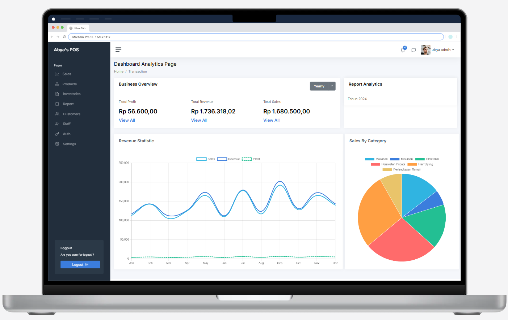
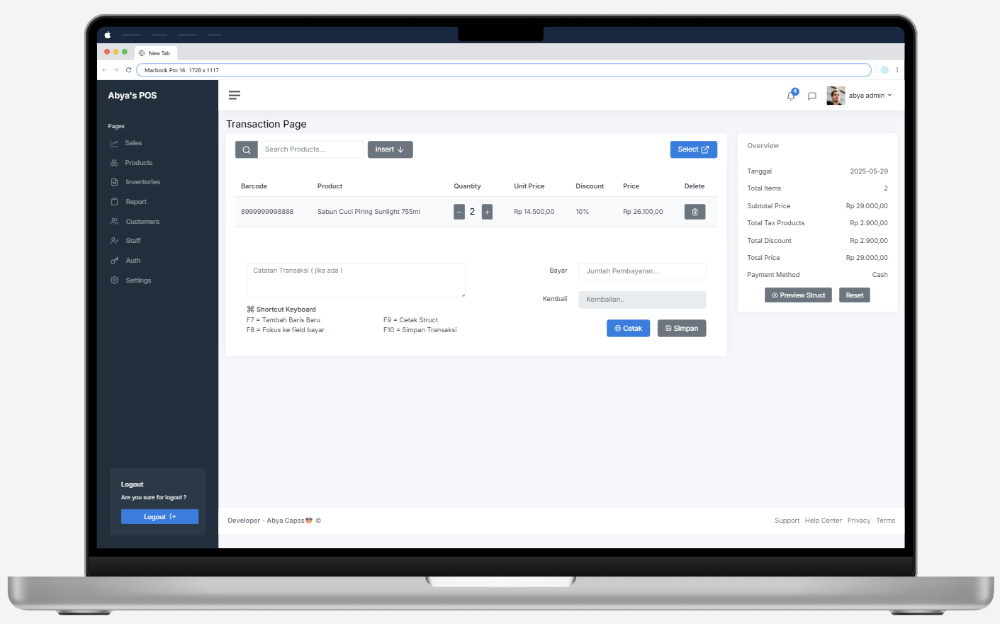
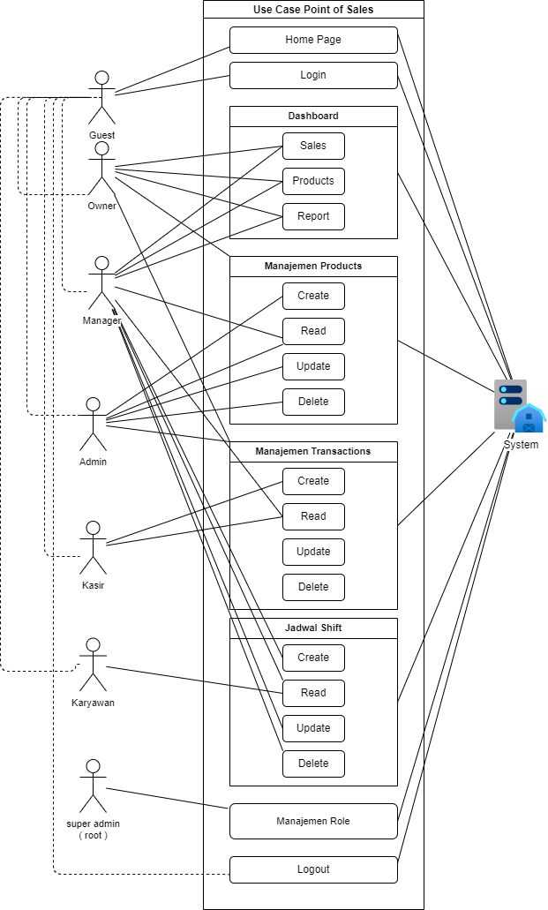
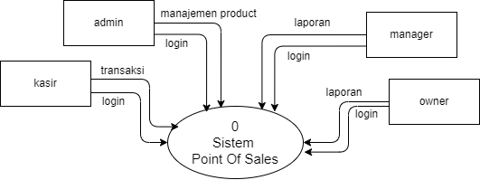
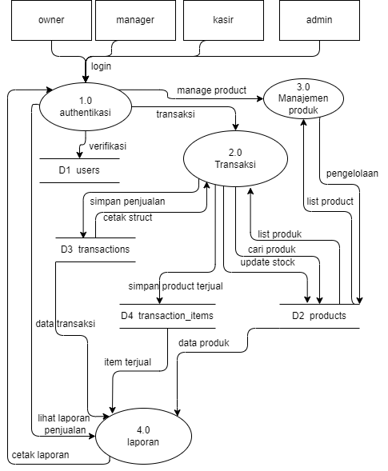

# **POINT OF SALES**

## Use Case Diagram

## Diagram Context

## Data Flow Diagram

---
## **📌 Feature Next Development**
Aplikasi ini dirancang untuk membantu bisnis dalam mengelola transaksi penjualan, stok produk, laporan keuangan, dan manajemen pengguna.  

**Pengguna Utama:**  
1. **Kasir** – Fokus pada transaksi penjualan dan pelaporan hasil penjualan harian ke admin.  
   - Melakukan transaksi penjualan.  
   - Memastikan total uang di sistem sesuai dengan yang diterima.  
   - Mengirim laporan harian ke admin.  

2. **Admin** – Bertanggung jawab atas operasional produk dan manajemen kasir. 
   - **Dashboard**
   - Akses CRUD untuk :
     - [ ] **Manajemen Kategori**   
     - [ ] **Manajemen Brand**
     - [ ] **Manajemen Data Supplier**
     - [ ] **Manajemen Produk**
     - [ ] **Manajemen Hutang**
     - [ ] **Manajemen Piutang**
     - [ ] **Manajemen Member**
   - Akses Notifikasi Stock

3. **Manajer** – Mengelola dan menganalisis laporan operasional.  
   - Mengekspor laporan dalam format PDF (harian, mingguan, bulanan).  
   - Memantau kinerja kasir dan operasional lainnya dengan dashboard yang lengkap.  
   - Mengambil insight dari hasil operasional untuk meningkatkan efisiensi bisnis.  

4. **Pemilik Toko** – Pengambil keputusan utama berdasarkan laporan dan keuntungan.  
   - Menerima laporan harian, mingguan, dan bulanan dari manajer.  
   - Melihat hasil keuntungan bisnis secara berkala dengan dashboard yang lengkap.  
   - Menentukan kebijakan pajak dan strategi bisnis baru.

## **🛠️ Fitur Utama**  

### **1️⃣ Proses Transaksi (Point of Sale) – Kasir**  
- [ ] Mencari produk dengan kode/barcode atau nama  
- [ ] Menambahkan produk ke keranjang belanja  
- [ ] Memilih metode pembayaran:  
   - **Tunai**  
   - **Kartu Debit/Kredit**  
   - **E-Wallet (QRIS, OVO, Gopay, dll.)**  
- [ ] Mencetak struk ke pelanggan ( No Refund )
- [ ] Membuat laporan hasil penjualan harian dan menyerahkannya ke admin  

---

### **2️⃣ Manajemen Operasional – Admin**  
- [ ] Kategori
- [ ] Brand
- [ ] Data Suplier 
- [ ] Product ➯ CRUD data Product dan Upload Image Product
- [ ] Hutang dan Piutang  
- [ ] Member 
- [ ] Stock Opname
- [ ] Transaksi Penjualan
- [ ] Transaksi Pembelian
- [ ] Transaksi Pengembalian 

---

### **3️⃣ Laporan & Analitik Operasional – Manajer**  
- [ ] Mengekspor laporan harian, mingguan, dan bulanan dalam format PDF  
- [ ] Memantau kinerja kasir berdasarkan transaksi dan laporan harian  
- [ ] Mengambil insight dari laporan operasional untuk peningkatan efisiensi  
- [ ] Menganalisis produk terlaris dan tren penjualan  

---

### **4️⃣ Pemantauan & Kebijakan Bisnis – Pemilik Toko**  
- [ ] Menerima laporan keuangan dari manajer (harian, mingguan, bulanan)  
- [ ] Melihat hasil keuntungan dan pengeluaran secara real-time  
- [ ] Menentukan kebijakan pajak dan strategi bisnis baru  

---

### **5️⃣ Manajemen Pengguna & Hak Akses**  
- [ ] Login & logout dengan autentikasi aman  
- [ ] Role-based access control (RBAC):  
   - **Kasir** → Hanya akses transaksi  
   - **Admin** → Mengelola operasional  
   - **Manajer** → Akses laporan & analitik operasional  
   - **Pemilik Toko** → Akses laporan keuangan & kebijakan bisnis  
- [ ] Reset password & pengaturan akun  

---

### **6️⃣ Pengaturan & Fitur Tambahan**  
- [ ] Pengaturan toko (nama, alamat, logo, pajak)  
- [ ] Manajemen diskon dan promo berbasis stok  
- [ ] Dukungan multi-outlet (cabang)  

---

## **📌 Alur Kerja Pengguna (Berbasis Role)**  

1. **Kasir melakukan transaksi & laporan harian**  
   → Login → Scan produk → Tambah ke keranjang → Pilih metode pembayaran → Cetak struk → Buat laporan harian ke admin  

2. **Admin mengelola produk, kasir, dan stok**  
   → Login → Manajemen produk → Tambah/edit produk → Kelola stok → Input biaya operasional → Kelola akun kasir  

3. **Manajer memantau & menganalisis laporan**  
   → Login → Dashboard laporan → Export laporan → Menganalisis performa penjualan  

4. **Pemilik toko menerima laporan & membuat kebijakan**  
   → Login → Cek laporan dari manajer → Analisis keuntungan → Menentukan kebijakan bisnis  

---
